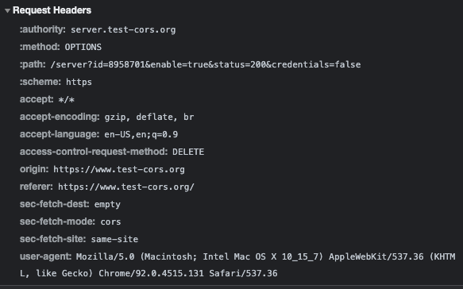

# Cors testing

## Content Type : Application/json; charset=utf-8

PreFlight request is triggered

### Request Headers

### Response Headers

## Content Type : text/plain

### GET request

No preflight request sent

#### Request headers

#### Response headers

### POST REQUEST

No preflight request sent

#### Request Headers

### OPTIONS request

PreFlight request is triggered

### CORS Error

#### Request Header

#### Response Header

### Delete Request

PreFlight request is triggered

#### CORS Error

#### Request Header

#### Response Header

### PUT request

PreFlight request is triggered

#### CORS Error

### Request Header

#### Response Header

### **[Research] what are the headers that can be set by JS and not trigger a pre-flight for GET request. Please explain, why the decision was made to allow a select set of content type for GET simple requests?**

There are a few requests which do not trigger a CORS preflight, such requests are denoted as 'simple requests' and must meet all the following conditions:

Are of the following methods:

- GET, POST, HEAD

Apart from the headers automatically set by user agent, the only headers allowed to be manually set are those in which 'Fetch' defines as being 'CORS safelisted request-headers' such as :

- Accept, Viewport-Width, Content-Type etc.

The only allowed values for content type Header being:

- application/x-www-form-urlencoded
- multipart/form-data
- text/plain

### **[Research] Is wildcard character (*) allowed in Access-Control-Allow-Origin response header? If so, under what conditions would wildcard not be allowed as value of “Access-Control-Allow-Origin” header?**

Wildcard parameters for Access-control-allow-origin headers are generally allowed for most scenarios except for when Access-control-allow-credentials header is also set to true. i.e. when the server is accepting cookies that are being sent from the client. Furthermore, wildcards **cannot** be used within any other value such as the following example:

`Access-Control-Allow-Origin: https://*.website.com`

## HTML Form

`const form = document.createElement('form');
const url = 'https://server.test-cors/server?id=817934&&enable=true&status=200&credentials=false';
form.action=url;
form.method='post';
const inputt = document.createElement('input');
inputt.type='text';
inputt.id='john';
const subm = document.createElement('input');
subm.type='submit';
subm.value='Submit';
form.appendChild(inputt);
form.appendChild(subm);
document.body.appendChild(form);`

