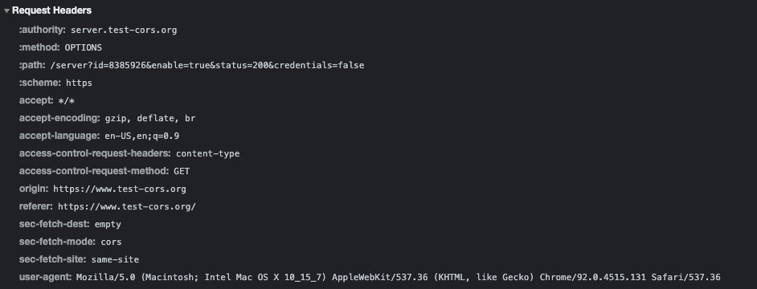
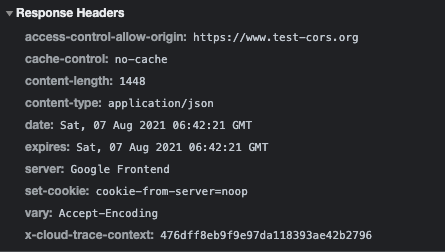

### Application/json; charset=utf-8

When sending a CORs request with content-type set as application/json, a preflight request **was** sent.

The request and response of the preflight request is shown below:

#### CORs Error

### Text/plain

For Both GET and POST request when the content-type was set to text/plain, a preflight request was NOT sent, and there was NO CORS errors thrown.

For Requests with content-type: text/plain, and methods set as OPTIONS, DELETE and PUT, a Preflight request was sent and each resulted in a CORs Error.

##### GET 

##### 

##### POST

##### OPTIONS

##### 

##### DELETE

##### 

##### 

##### PUT

### **[Research] what are the headers that can be set by JS and not trigger a pre-flight for GET request. Please explain, why the decision was made to allow a select set of content type for GET simple requests?**

There are a few requests which do not trigger a CORS preflight, such requests are denoted as 'simple requests' and must meet all the following conditions:

Are of the following methods:

- GET, POST, HEAD

Apart from the headers automatically set by user agent, the only headers allowed to be manually set are those in which 'Fetch' defines as being 'CORS safelisted request-headers' such as :

- Accept, Viewport-Width, Content-Type etc.

The only allowed values for content type Header being:

- application/x-www-form-urlencoded
- multipart/form-data
- text/plain

### **[Research] Is wildcard character (*) allowed in Access-Control-Allow-Origin response header? If so, under what conditions would wildcard not be allowed as value of “Access-Control-Allow-Origin” header?**

Wildcard parameters for Access-control-allow-origin headers are generally allowed for most scenarios except for when Access-control-allow-credentials header is also set to true. i.e. when the server is accepting cookies that are being sent from the client. Furthermore, wildcards **cannot** be used within any other value such as the following example:

`Access-Control-Allow-Origin: https://*.website.com`

## HTML Form - INCOMPLETE

`const dummy = document.createElement('iframe');
dummy.id='dummyframe';
const form = document.createElement('form');
const url = 'https://server.test-cors/server?id=817934&&enable=true&status=200&credentials=false';
form.action=url;
form.method='POST'; 
form.target='dummyframe';
const inputt = document.createElement('input');
inputt.type='text';
inputt.id='john';
const subm = document.createElement('input');
subm.type='submit';
subm.value='Submit';
form.appendChild(inputt);
form.appendChild(subm);
document.body.appendChild(dummy);
document.body.appendChild(form);`

redirects and does not send a cors request,  I tried to have the form target an iframe instead so it doesnt redirect, but it still does not send a cors request that we can intercept

## Understanding CORs and Cookies 

Initially when sending a GET request with content-type: text/plain, and without the 'with credentials' as well as 'allow credentials'

there was:

- NO preflighted request
- It did NOT contain the 'my-dummy-cookie'
- There was no Access-control-allow-credentials header in the server response.

However if we set the server response to contains the Access-control-allow-credentials header, then the cookies are sent.

Thus it is concluded that, cookies are only sent if the browser sends a request with 'credentials' set as true,  as well as the server responding with a 'access-control-allow-credentials' header also set to true.

## Response Redirection 

When the response for the preflight response was edited to a 301 moved permanently with location set to google.com, the browser throws a CORs error stating that redirect is not allowed for a preflight request

